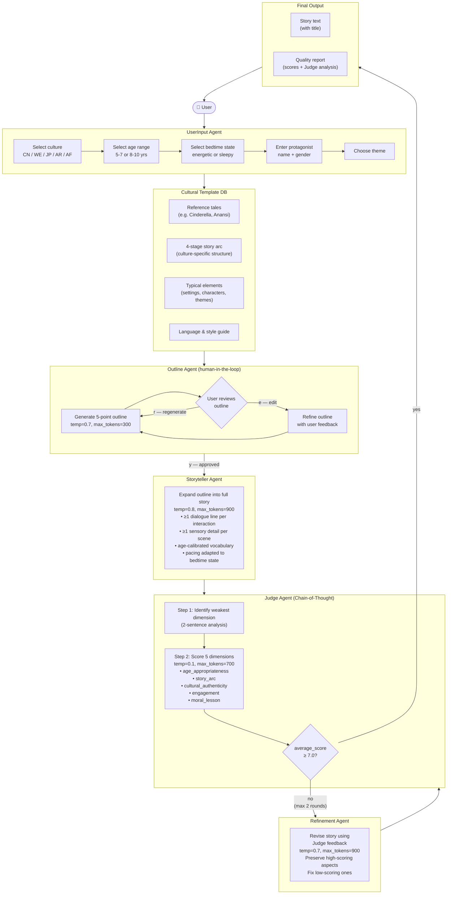

# System Block Diagram

## Mermaid Flowchart



---

## ASCII Block Diagram

```
┌──────────────────────────────────────────────────────────────────┐
│                     BEDTIME STORY GENERATOR                      │
└──────────────────────────────────────────────────────────────────┘

  ┌──────────┐
  │   USER   │
  └────┬─────┘
       │ culture / age range / bedtime state / protagonist / theme
       ▼
┌─────────────────────────────────────────────────────────────────┐
│  UserInput Agent                                                │
│  [culture menu] → [age 5-7/8-10] → [sleepy/energetic]          │
│  → [name + gender] → [theme] → [confirm]                       │
└─────────────────────────┬───────────────────────────────────────┘
                          │ story_request dict
                          ▼
               ┌─────────────────────┐
               │  Cultural Template  │  reference tales + story arc
               │        DB           │  + elements + language style
               └──────────┬──────────┘
                          │ template injected into all prompts
                          ▼
┌─────────────────────────────────────────────────────────────────┐
│  Outline Agent  (human-in-the-loop)                             │
│                                                                 │
│  generate_outline()  ──►  5-bullet story outline                │
│       ↓                                                         │
│  Show to user  ──►  y: approved  /  e: edit  /  r: regenerate  │
│       ↓ (y)                                                     │
│  approved_outline                                               │
└─────────────────────────┬───────────────────────────────────────┘
                          │ approved 5-point outline
                          ▼
┌─────────────────────────────────────────────────────────────────┐
│  Storyteller Agent                                              │
│                                                                 │
│  prompt = cultural_arc + elements + style + age guidance        │
│         + pacing (sleepy/energetic) + outline                   │
│  call_model(temperature=0.8)  ──►  draft_story                  │
└─────────────────────────┬───────────────────────────────────────┘
                          │ draft_story
                          ▼
┌─────────────────────────────────────────────────────────────────┐
│  Judge Agent  (Chain-of-Thought scoring)                        │
│                                                                 │
│  Step 1: Identify weakest dimension (2-sentence analysis)       │
│  Step 2: Score 5 dimensions (integer 1-10 each):                │
│     age_appropriateness │ story_arc │ cultural_authenticity     │
│     engagement          │ moral_lesson                          │
│                                                                 │
│  average_score = mean(5 scores)                                 │
│  output: scores + justifications + suggestions + feedback       │
└────────────┬──────────────────────────┬─────────────────────────┘
             │                          │
  avg ≥ 7.0  │                          │  avg < 7.0  (max 2 rounds)
             │                          ▼
             │          ┌───────────────────────────┐
             │          │  Refinement Agent         │
             │          │                           │
             │          │  prompt = original_story  │
             │          │    + per-dimension scores │
             │          │    + specific suggestions │
             │          │  call_model(temp=0.7)     │
             │          └─────────────┬─────────────┘
             │                        │ refined_story
             │                        ▼
             │          ┌─────────────────────────┐
             │          │  Judge Agent (re-score)  │◄── loop ≤2×
             │          └─────────────┬───────────┘
             │                        │
             │              avg ≥ 7.0 │  or max rounds reached
             │◄───────────────────────┘
             ▼
┌─────────────────────────────────────────────────────────────────┐
│  Final Output                                                   │
│  • Story text (TITLE + body)                                    │
│  • Quality report (5-dimension scores + Judge analysis)         │
└─────────────────────────────────────────────────────────────────┘
```

---

## Agent Roles Summary

| Agent | Role | Temperature | Key Prompt Strategy |
|---|---|---|---|
| UserInput | Collect preferences | — | Structured menus + validation |
| Outline | Plan story structure | 0.7 | Cultural arc injection; user editable |
| Storyteller | Write full story | 0.8 | Arc + template + mandatory craft rules |
| Judge | Evaluate quality | 0.1 | Chain-of-thought before scoring; JSON output |
| Refinement | Fix weak dimensions | 0.7 | Preserve strengths; target only low-scoring dims |
